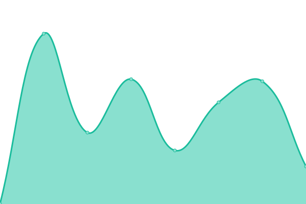

# [📈 Live Status](https://PnPH.github.io/UpDB): <!--live status--> **🟩 All systems operational**

This repository contains the open-source uptime monitor and status page for [Panophobia](https://PnPH.github.io/UpDB), powered by [Upptime](https://github.com/upptime/upptime).

With [Upptime](https://upptime.js.org), you can get your own unlimited and free uptime monitor and status page, powered entirely by a GitHub repository. We use [Issues](https://github.com/PnPH/UpDB/issues) as incident reports, [Actions](https://github.com/PnPH/UpDB/actions) as uptime monitors, and [Pages](https://PnPH.github.io/UpDB) for the status page.

<!--start: status pages-->
<!-- This summary is generated by Upptime (https://github.com/upptime/upptime) -->
<!-- Do not edit this manually, your changes will be overwritten -->
<!-- prettier-ignore -->
| URL | Status | History | Response Time | Uptime |
| --- | ------ | ------- | ------------- | ------ |
|  Source | 🟩 Up | [source.yml](https://github.com/PnPH/UpDB/commits/HEAD/history/source.yml) | 

 394ms
     
 | 

<a href="https://PnPH.github.io/UpDB/history/source">100.00%</a>
    

|  WP Nur | 🟩 Up | [wp-nur.yml](https://github.com/PnPH/UpDB/commits/HEAD/history/wp-nur.yml) | 

 7163ms
     
 | 

<a href="https://PnPH.github.io/UpDB/history/wp-nur">100.00%</a>
    

|  WP Far | 🟩 Up | [wp-far.yml](https://github.com/PnPH/UpDB/commits/HEAD/history/wp-far.yml) | 

 3598ms
     
 | 

<a href="https://PnPH.github.io/UpDB/history/wp-far">100.00%</a>
    

|  WP ERBM | 🟩 Up | [wp-erbm.yml](https://github.com/PnPH/UpDB/commits/HEAD/history/wp-erbm.yml) | 

 7390ms
     
 | 

<a href="https://PnPH.github.io/UpDB/history/wp-erbm">100.00%</a>
    

<!--end: status pages-->

[**Visit our status website →**](https://PnPH.github.io/UpDB)

## 📄 License

- Powered by: [Upptime](https://github.com/upptime/upptime)
- Code: [MIT](./LICENSE) © [Panophobia](https://PnPH.github.io/UpDB)
- Data in the `./history` directory: [Open Database License](https://opendatacommons.org/licenses/odbl/1-0/)
